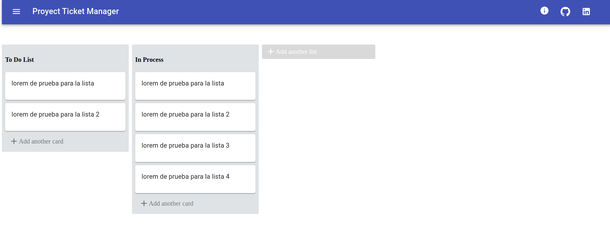
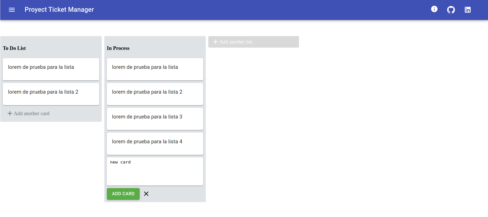
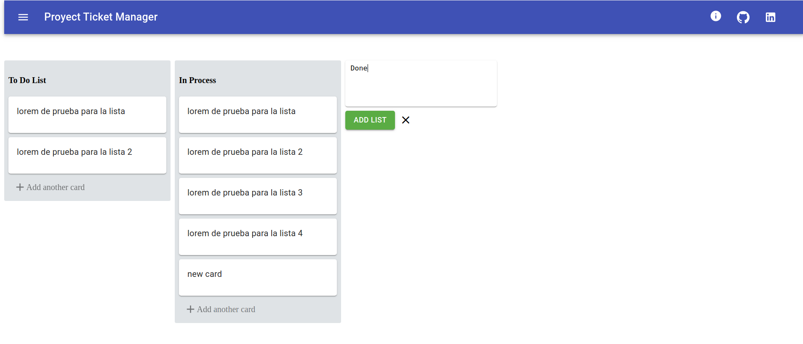
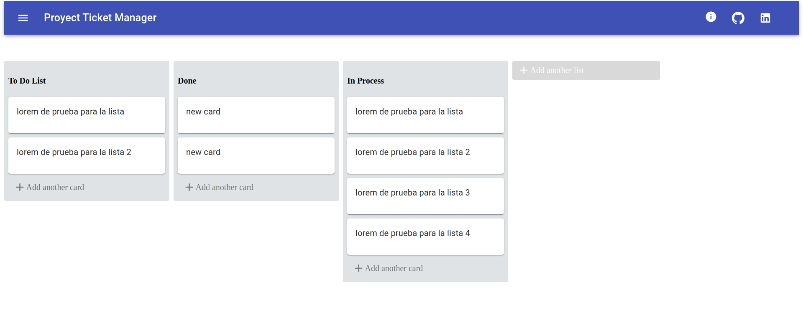

# Proyect Ticket Manager

A simple task manager similar to Trello which is perfect for working with the Scrum methodology

## Pre Requisites

then install the dependecies for both projects(backoffice and frontscript) with:

```shell
npm install
```

__NOTE__ You can install just one project's dependecies, just go to the target folder ans run
```npm install```

# React Project

This project was bootstrapped with [Create React App](https://github.com/facebook/create-react-app).

In the project director you can run

### `npm start`

Runs the app in the development mode.<br>
Open [http://localhost:3000](http://localhost:3000) to view it in the browser.

### `npm run build`

Builds the app for production to the `build` folder.<br />
It correctly bundles React in production mode and optimizes the build for the best performance.

The build is minified and the filenames include the hashes.<br />
Your app is ready to be deployed!

See the section about [deployment](https://facebook.github.io/create-react-app/docs/deployment) for more information.

# Development technologies

- [ReactJS](https://reactjs.org/)
- [Redux](https://redux.js.org/)    
- [Material-UI](https://material-ui.com/)
- [Styled Components](https://www.styled-components.com/)
- [React beautiful dnd](https://github.com/atlassian/react-beautiful-dnd)
- Local Storage

# Images



- You can create new tasks



- You can create new lists



- you can move them in a similar way to Trello



