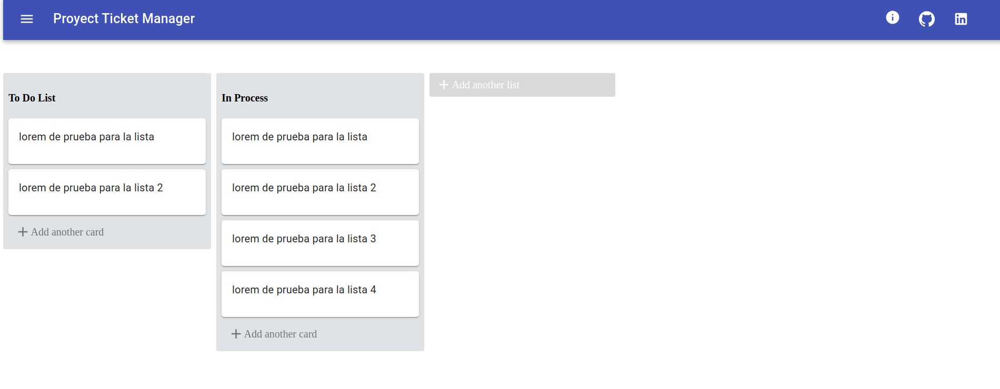
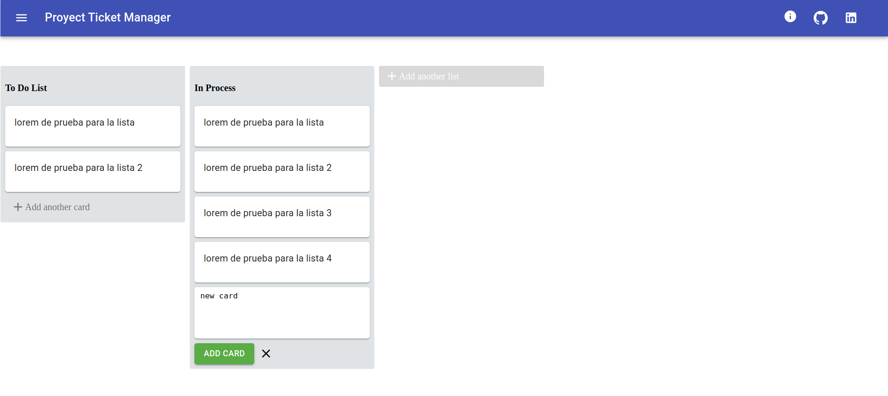
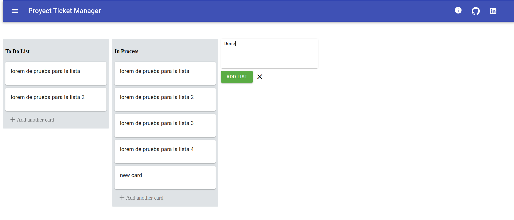
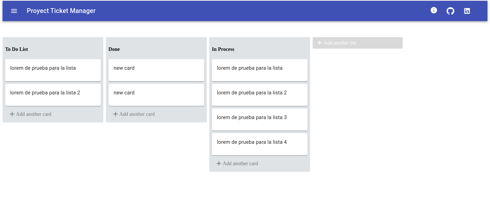

# Proyect Ticket Manager

A lightweight ticket board for working with the Scrum methodology.

## Features

- Drag & drop cards between lists, and reorder the lists themselves
- Each ticket has a **type** (Task / Bug / Story) and a **priority**
  (Highest → Lowest), both shown as colour-coded icons on the card
- Delete a card from the button that appears when you hover it
- The board is **persisted to Local Storage**, so it survives a reload

## Pre Requisites

Node.js 20 or newer. Install the dependencies with:

```shell
npm install
```

# React Project

This project runs on [Vite](https://vite.dev/). In the project directory you can run:

### `npm run dev`

Runs the app in development mode with hot module replacement.<br>
Open [http://localhost:3000](http://localhost:3000) to view it in the browser (Vite picks the
next free port if 3000 is taken).

### `npm run build`

Builds the app for production into the `dist` folder.<br />
The build is minified and the filenames include hashes.

### `npm run preview`

Serves the production build locally so you can verify it before deploying.

### `npm run deploy`

Builds and publishes `dist` to GitHub Pages.

# Development technologies

- [React](https://react.dev/) 19
- [Redux Toolkit](https://redux-toolkit.js.org/) + [React Redux](https://react-redux.js.org/)
- [MUI](https://mui.com/) 9 (styling via its Emotion-based `styled` and `sx`)
- [@hello-pangea/dnd](https://github.com/hello-pangea/dnd) — maintained fork of react-beautiful-dnd
- [Vite](https://vite.dev/)
- Local Storage for persistence

__NOTE__ The board is saved in your browser under the `ptm.board.v1` key. Clearing
site data resets it to the seed board.

# Images



- You can create new tasks



- You can create new lists



- you can move them in a similar way to Trello


